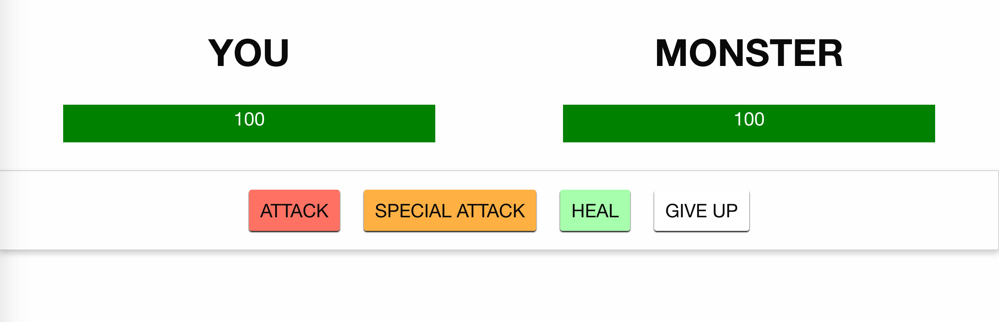

# Monster-Slayer (Vue Js)

**Critères qualité**
------------------
* Vue JS only => Zéro manipulation native DOM !!!
* Framework CSS : Bulma
* Les boutons de combat ne sont pas accessibles
* Un bouton « New Game » est accessible
* New Game donne accès aux boutons de combat
* Les barres de vies sont mise à jour en temps réel
* A la fin de chaque partie demander une confirmation de nouvelle partie

**Des Commits**
* First Commit , Add README.md
* Add HTML , CSS , JS
* Add image to README.md
* Add contenu of file html
* Add the components and instance
* Add file index.js , divide the components
* Add the functions in the methods of the instance
* Modify index.html
* Rename the components , add button Restart 
* Fix the props , add v-bind
* Rename the variables Hit Point
* Fix the operators in the functions
